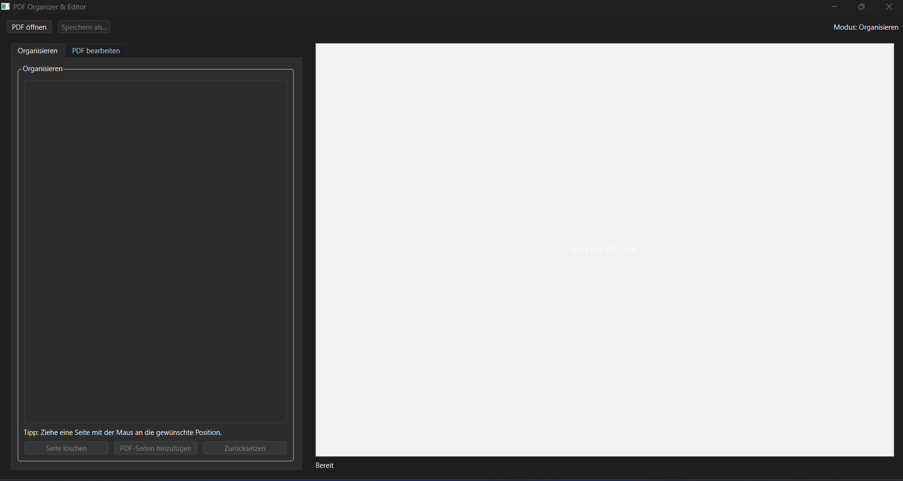
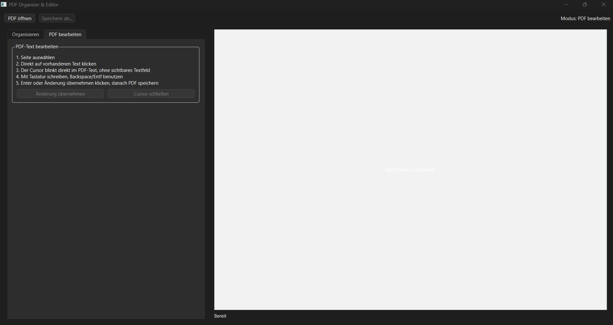

# PDF Organizer

## Beschreibung

PDF Organizer ist eine Desktop-Anwendung zum Organisieren und Bearbeiten von PDF-Dateien.

Die Anwendung bietet zwei Hauptfunktionen:

- **PDF organisieren**
  - Seiten per Drag & Drop verschieben
  - Seiten löschen
  - Seiten aus einer anderen PDF hinzufügen
  - Änderungen als neue PDF speichern

- **PDF bearbeiten**
  - Text direkt innerhalb der PDF bearbeiten
  - Bearbeitungen an der ursprünglichen Position übernehmen
  - Änderungen als neue PDF speichern

---

## Verwendete Technologien

**Programmiersprache**

- Python 3.14

**Bibliotheken**

- PySide6 – Grafische Benutzeroberfläche
- PyMuPDF (fitz) – PDF-Anzeige und Bearbeitung
- pypdf – Verwalten von PDF-Seiten
- Pillow – Bildverarbeitung für Seitenvorschauen

---

## Installation

1. Projekt herunterladen oder klonen.
2. Im Projektordner ein Terminal öffnen.
3. Benötigte Bibliotheken installieren:

```bash
pip install -r requirements.txt
```

Falls keine `requirements.txt` vorhanden ist:

```bash
pip install PySide6 pymupdf pypdf Pillow
```

---

## Anwendung starten

```bash
python app.py
```

---

## EXE erstellen

Zum Erstellen einer Windows-Anwendung einfach die Datei

```text
build.bat
```

ausführen.

Die fertige EXE befindet sich anschließend im Ordner:

```text
dist\
```

---

## Getestete Umgebung

- Windows 11
- Python 3.14.6

---

## Screenshots

### Organisieren



### Bearbeiten

